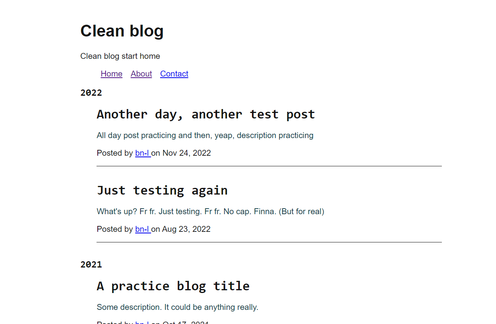

# Clean starter blog 
Uses [metalsmith](https://github.com/metalsmith/metalsmith) and [pug](https://pugjs.org/language/)

This starting base is basically completely unstyled and can be adapted or used as is (for a sleek minimal look).

 

<!-- <video src="./docs/screen-capture-clean-blog.mp4"> -->

 

<video width="100%" height="100%" controls>
  <source src="docs/screen-capture-clean-blog.mp4" type="video/mp4">
</video>

 

It doesn't look like much but thanks to metalsmith, all you need to do is write markdown file and they'll be converted into blog posts and nicely formatted like above.

Note: uses UK DD-MM-YY date style in [front matter](https://jekyllrb.com/docs/front-matter/)

