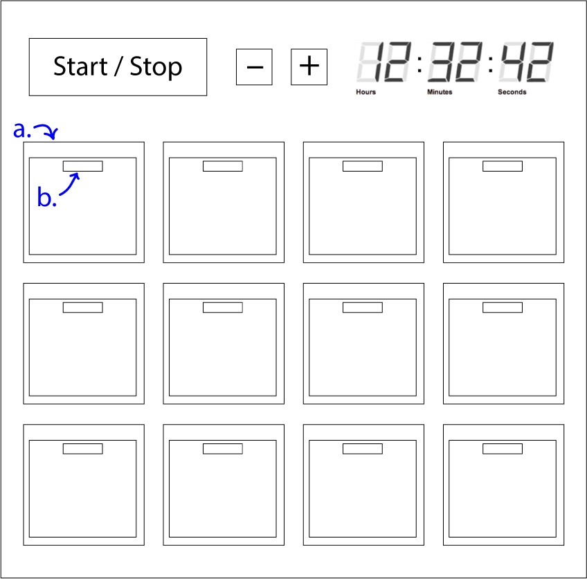

- A locker where you set a timer 
- At completion an alarm will sound and the first closed locker will open
- Alarm set by pressing - / +. Holding has acceleration. Press Start / Stop after an alarm to renew the same timer.
- a.: Plastic box (like an advent calendar) that can hold a treat. It is recessed into the main body
- b:  Magnetic release mechanism

