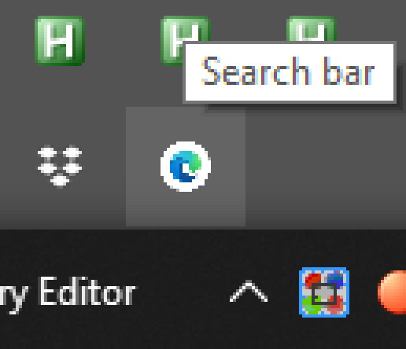
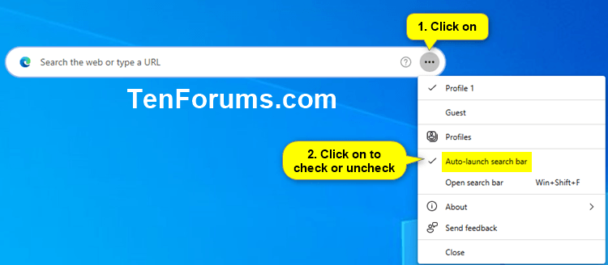

## Disable this 

### A. Registry

1. Start menu > type "registry" > right click > run Registry Editor as admin (or open it if you don't have this option) 

2. In the input field at the top, under the menu bar, paste this: 

    `Computer\HKEY_LOCAL_MACHINE\SOFTWARE\Policies\Microsoft\Edge`

3. Do this twice: Right click > New > DWORD (32 bit value). 

    Now: right click > rename each to:

    `WebWidgetIsEnabledOnStartup`

    `WebWidgetAllowed`

4. Make sure each DWORD's value is 0 (it should be by default)

### B. Double kill: Group policy

1. Download the file `MicrosoftEdgePolicyTemplates.cab` at the [edge enterprise page](https://aka.ms/EdgeEnterprise) and extract the contents. [This](https://msedge.sf.dl.delivery.mp.microsoft.com/filestreamingservice/files/41bed53b-c6e0-4b79-bf1f-bd33844b7aea/MicrosoftEdgePolicyTemplates.cab) is the direct link I got (may not still work).

2. Extract the cab and then the zip and find the folder `admx`. It should be at `(extract folder)\MicrosoftEdgePolicyTemplates\windows\admx\`

2. Copy all the `.admx` files to `C:\Windows\PolicyDefinitions`. Then back in the admx folder find your language folder (e.g. `en-US`). Copy all the `.adml` files there to the corresponding language folder at `PolicyDefinitions`
3. Start menu > type: `gpedit.msc` > open as admin (or just open). 
4. Click: Computer Configuration > Administrative Templates > All settings. 
    Then (menu bar) View > Filter options > Filter for word(s) > input `WebWidgetAllowed`
5. Filter. Microsoft Edge > Disable the setting for Computer and User

Note this is necessary because this user setting is not respected:

(Source: [win10 forums](https://www.tenforums.com/tutorials/203448-disable-microsoft-edge-desktop-search-bar-startup-windows-10-a.html))

Microsoft is a content platform. The platform is the OS. But (probably) a significant number of users are not (according to their telemetrics) viewing enough "content" (advertising). This is why on each new update, a new method of accessing these users (like me) is attempted. 

I believe the name for this new ad delivery tool is an intentional dark pattern. "Search Bar" is designed to fudge the search results. If you google "windows search bar" every single result is people who call the start menu search the "search bar". I did also before this came out. So information on how to remove it is completely burried. 

Incidentally, while searching on this topic, I found this really nice windows 11 setup process that removes a lot of junk and installs things like the ms edge group policy settings: https://github.com/Tom4tot/Windows-11-Personal-Setup

Sources:

[Installing admin templates](https://www.alitajran.com/install-administrative-template-files-for-microsoft-office/) (verbose content marketing help)

["WebWidgetAllowed" on microsoft's docs](https://learn.microsoft.com/en-us/deployedge/microsoft-edge-policies#webwidgetallowed)

[The registry method at win 10 forums](https://www.tenforums.com/tutorials/203446-enable-disable-microsoft-edge-desktop-search-bar-windows-10-a.html) (the true MVPs for a long time)

