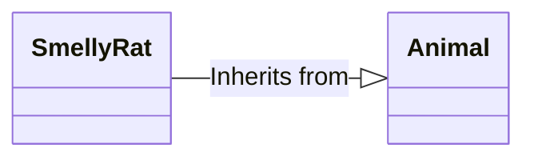

## Relationships

### Inheritance

Each **SmellyRat** is an instance of an **Animal**. A **SmellyRat** will have the usual things animals have (like a heart, brain) but a **SmellyRat** adds its own character: Smell, indefinable ratness, fur.

## Association

### Bidirectional

<svg id="Layer_1" data-name="Layer 1" viewBox="0 0 548 140"><defs></defs><path class="cls-1"/><rect class="cls-1" x="195.5" y="74.5" width="38" height="22"/><text class="cls-2" transform="translate(197 90)">1..*</text><path class="cls-3" d="M187.5,70h173"/><path class="cls-4" d="M.5,79.5V.5h187v79"/><path class="cls-5" d="M.5,79.5v60h187v-60"/><path class="cls-5" d="M.5,79.5h187"/><text class="cls-6" transform="translate(35.47 50.5)">SmellyRat</text><path class="cls-5" d="M.5,109.5h187"/><path class="cls-4" d="M360.5,79.5V.5h187v79"/><path class="cls-5" d="M360.5,79.5v60h187v-60"/><path class="cls-5" d="M360.5,79.5h187"/><text class="cls-6" transform="translate(418.14 50.5)">Sewer</text><path class="cls-5" d="M360.5,109.5h187"/><text class="cls-2" transform="translate(320 90)">1..1</text><text class="cls-2" transform="translate(314 59)">home</text><text class="cls-2" transform="translate(194 59)">residents</text><path class="cls-1"/></svg>

