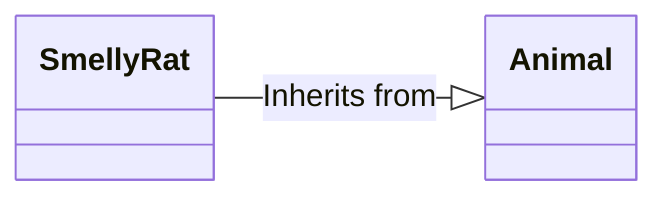
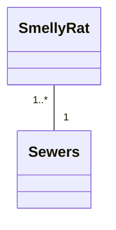
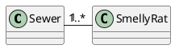

## Relationships

### Inheritance

Each **SmellyRat** is an instance of an **Animal**. A **SmellyRat** will have the usual things animals have (like a heart, brain) but a **SmellyRat** adds its own character: Smell, indefinable ratness, fur.

## Association

### Bidirectional

<svg xmlns="http://www.w3.org/2000/svg" xmlns:xlink="http://www.w3.org/1999/xlink" style="background-color:#fff" viewBox="-0.5 -0.5 713 140"> <path fill="none" d="M257 74h38v22h-38z" pointer-events="all"/> <switch transform="translate(-.5 -.5)"> <foreignObject width="100%" height="100%" pointer-events="none" requiredFeatures="http://www.w3.org/TR/SVG11/feature#Extensibility" style="overflow:visible;text-align:left"> 
 
 
 1..* 
 
 
 </foreignObject> <text x="259" y="90" fill="#FF8000" font-family="Helvetica" font-size="13">1..*</text> </switch> <path fill="none" stroke="#000" stroke-miterlimit="10" d="M251 69.5h209" pointer-events="stroke"/> <path fill="#fff2cc" stroke="#d6b656" stroke-miterlimit="10" d="M0 79V0h251v79" pointer-events="all"/> <path fill="none" stroke="#d6b656" stroke-miterlimit="10" d="M0 79v60h251V79M0 79h251" pointer-events="none"/> <text x="125" y="50" font-family="Helvetica" font-size="24" font-weight="bold" pointer-events="none" text-anchor="middle">SmellyRat</text> <path fill="none" stroke="#d6b656" stroke-miterlimit="10" d="M0 109h251" pointer-events="none"/> <path fill="#fff2cc" stroke="#d6b656" stroke-miterlimit="10" d="M460 79V0h251v79" pointer-events="none"/> <path fill="none" stroke="#d6b656" stroke-miterlimit="10" d="M460 79v60h251V79m-251 0h251" pointer-events="none"/> <text x="585" y="50" font-family="Helvetica" font-size="24" font-weight="bold" pointer-events="none" text-anchor="middle">Sewer</text> <path fill="none" stroke="#d6b656" stroke-miterlimit="10" d="M460 109h251" pointer-events="none"/> <switch transform="translate(-.5 -.5)"> <foreignObject width="100%" height="100%" pointer-events="none" requiredFeatures="http://www.w3.org/TR/SVG11/feature#Extensibility" style="overflow:visible;text-align:left"> 
 
 
 1..1 
 
 
 </foreignObject> <text x="424" y="90" fill="#FF8000" font-family="Helvetica" font-size="13">1..1</text> </switch> <switch transform="translate(-.5 -.5)"> <foreignObject width="100%" height="100%" pointer-events="none" requiredFeatures="http://www.w3.org/TR/SVG11/feature#Extensibility" style="overflow:visible;text-align:left"> 
 
 
 home 
 
 
 </foreignObject> <text x="418" y="59" fill="#FF8000" font-family="Helvetica" font-size="13">home</text> </switch> <switch transform="translate(-.5 -.5)"> <foreignObject width="100%" height="100%" pointer-events="none" requiredFeatures="http://www.w3.org/TR/SVG11/feature#Extensibility" style="overflow:visible;text-align:left"> 
 
 
 rodents 
 
 
 </foreignObject> <text x="256" y="59" fill="#FF8000" font-family="Helvetica" font-size="13">rodents</text> </switch> <switch> </switch> </svg>

