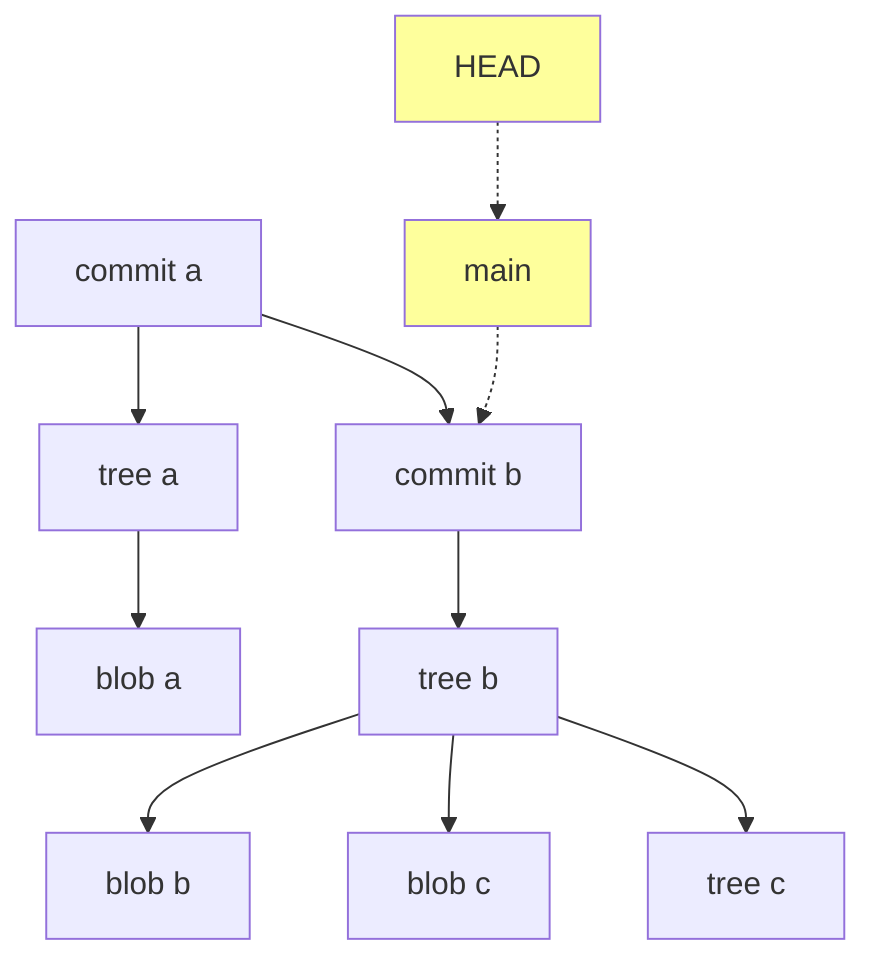

----

## Intro

A git repo [under the hood](https://archive.ph/wip/YX2Ic) is a directed acyclic graph ([DAG](https://en.wikipedia.org/wiki/Directed_acyclic_graph)):



This repo started at **commit a** (where HEAD and main initially pointed to). A commit happened and now it is at **commit b**. The structure is a lot simpler than it appears. Starting from the bottom:
- Git objects (DAG nodes, identified by a SHA1):
  - **Blob:** how git stores *files*.
  - **Tree:** Correspond to *directories*. They point to blobs (or other trees) and store file names and other file information
  - **Commits:** A snapshot of the files a certain point. They have a "commit message" and point to the previous commit and a single tree.
- References:
  - **HEAD and main:** (case sesitive) not git objects. Git calls these "references". They're like post-it notes on nodes in the DAG. Literally a file named "HEAD" (or "branch name") containing a single line: the commit SHA1 or the name of another ref. Stored in project/.git/refs.
  - A node on the git DAG must have a reference to it or else it can be garbage collected / deleted.
  - Nodes cannot be mutated but these "post-its" can be moved around freely. They don't get stored in the history, and they aren't *directly*[^1] transferred between repositories. They act like bookmarks.

## Further Concepts

### Remotes:

- Named git urls
- Naming allows quick reference. Can simply use an identifier instead of typing: http:… etc
- Literally listed in .git/config like this (git's config file is [basically](https://stackoverflow.com/a/68461700/20603697) INI format):
  ```	ini
  [remote "origin"]
      url = https://github.com/bn-l/bn-l-site-blog.git
      fetch = +refs/heads/*:refs/remotes/origin/*
  ```

### HEAD

Like a [tape head](http://hyperphysics.phy-astr.gsu.edu/hbase/Audio/tape2.html), this is where writes happen.

### Branching

- Branches are like post-it notes stuck on the **end** (always on the end) of a series of commits
- When HEAD is pointing to a branch (e.g. "main") it means a file called HEAD contains single line like "ref: refs/heads/main". When pointing to a commit it will contain the SHA1 of the commit.
- **Committing to a branch**:
  - Here HEAD is pointing to a branch called main which is pointing to commit a:
   ``` mermaid
   flowchart TB
   	HEAD-.->main-.->1[commit a]
   	style HEAD fill:#feff9c
      style main fill:#feff9c
   ```
  - The result of a commit called "commit b":
   ```mermaid
   flowchart TB
   	HEAD-.->main-.->1[commit b]
   	1[commit b]-->2[commit a]
   	style HEAD fill:#feff9c
      style main fill:#feff9c
   ```
- **Detached head mode**:
  - When pointing to (AKA referencing) a **commit** (vs a ref) the HEAD is considered "detached" (…from a branch with a named reference—like main or dev)
  - If you commit again the only reference to this offshoot will be the HEAD. Moving to another commit will leave the offshoot without a reference and it will be subject to GC.
  - **Allows for wild experimentation**: Checkout a commit. Do whatever you like. Checkout back to a named branch and forget it ever happened.
- **Orphan branches**:
  - Allows for new branches without the commit history (i.e. one new node with all the file changes but none of the commit messages)
  - Good for creating a branch that doesn't disclose the previous commit messages when pushing to a public repo:
   ```shell
   git checkout --orphan docs # (docs is the name of the branch)
   git commit -m "new docs branch"
   git push origin docs
   ```

### Merge
- When merging two commits git will try to do it automatically. If there are conflicting changes it will then pause in the "unmerged" state (see [git status command)](/posts/git-commands).
- White space characters can cause unwanted merge conflicts (e.g. the document is reformatted from tabs to spaces). Options exist to
  ignore white space.
- Merge stages (these are recorded by git):

  1. Find the common ancestor in the DAG
  2. "Ours": 
  3. "Theirs": The commit that is being "merged in"

- **Conflicts**:
  - This command will show conflicts that are pausing the merge (adding *-p* gives the detailed diffs):
    ```shell
      git log --oneline --left-right --merge
    ```
  - Calling "--continue" with the command that caused a merge conflict will try and continue the merge

### Rebasing

- Usually, to merge two commits, a new commit is created that is a combination of two. Rebasing instead merges and changes the parent of a commit.
- E.g.: you're on the branch "dev" and you want to merge what you've done with main. Instead of creating a new "merge" commit on main you can change the parent of the dev branch to be the same commit main points to.

### Fetch

- Unlike pull does not modifiy local files unless specifically checked out
- Safely downloads or updates: files, commits and refs from a remote repo
- Fetches "origin" when called without specifics

### Pull

- Like fetch in that it downloads remote content but then immediately does a merge with local files
- Can be called with "--rebase"  option and will rebase instead of merging

### Push

- "Updates remote refs using local refs, while sending objects necessary to complete the given refs." (from the manual)
  - E.g. if the remote has no branch called "feature/hello-world" a ref in the remote repo will be created pointing to a specific commit (the "necessary objects"). 
- Default behaviour: 
  - If destination repo not specified defaults to "origin"
  - Current branch is pushed to the default corresponding branch if branch not specified. E.g. if on the dev branch it will try to push to a branch called "dev" on the remote (push is aborted if upstream
    does not have a branch with the same name)
- **NOTE** It is [*not* the opposite of a pull](https://stackoverflow.com/questions/26005031/what-does-git-push-do-exactly#comment107413312_26005964):
  - Confusing misnomer.
  - It gives the remote repo your refs and objects and *asks* them to update their refs
  - If a fast forward (automatic) merge is possible, then the remote branch will do this, but otherwise not unless -f or force option is used and is allowed.

### Cherry-pick

 Applies only the changes from a specified commit, creating a new commit for the combination.

### Git shortcut references

([location](https://git-scm.com/book/en/v2/Git-Tools-Revision-Selection) in the git manual)

```shell
git show HEAD^ #the parent of HEAD. 
```
```shell
git show HEAD~ #the parent of HEAD
```
```shell
git show HEAD~3 #the third ancestor of head
```
```shell
git show HEAD~~~ #the third ancestor of head
```


### The three **"trees"**

NOTE!: This, confusingly, does not refer to a "tree" object in the DAG, but to the "three tree" model in git:

- **Working tree:** The literal files in the working directory which can be tracked and untracked (or watched)
- **Staging tree** AKA the "index":  The files *to be* committed. A "git add ." will "add" all tracked files from the working tree to the staging tree.
- **Commit tree**: Staged files are added to a new node in the git DAG (and stored locally in a blob)


## References

- [Git for Computer Scientists](https://eagain.net/articles/git-for-computer-scientists/) ([a](https://archive.ph/YX2Ic))
- [Stack Overflow: What does GIT PUSH do exactly?](https://stackoverflow.com/a/26005964/20603697) ([a](https://archive.ph/6AZdA))


[^1]: You get or give refs when you get or give a repo. E.g. if you're getting one (like with git clone) you get a set of refs namespaced under the remote name. These will literally be at: /repo-name/.git/refs/remotes/remote-name. 

*[main]: Also called master.

*[GC]: Garbage collection 


