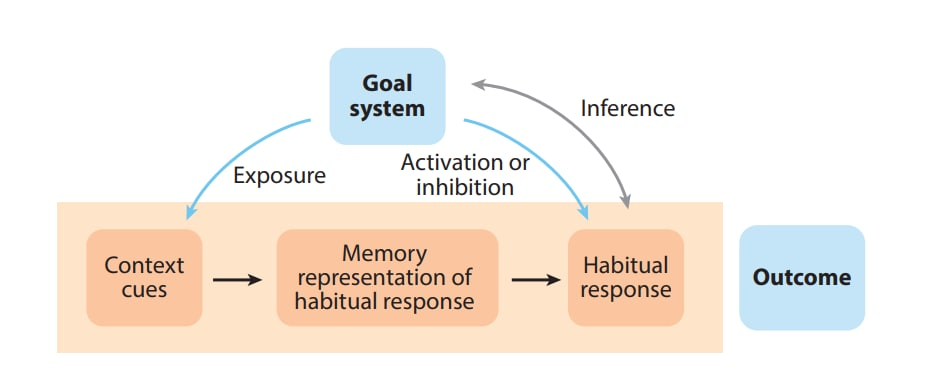
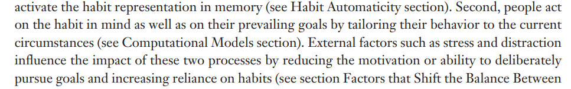
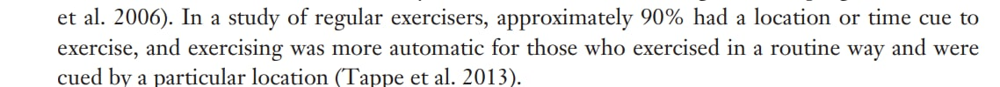
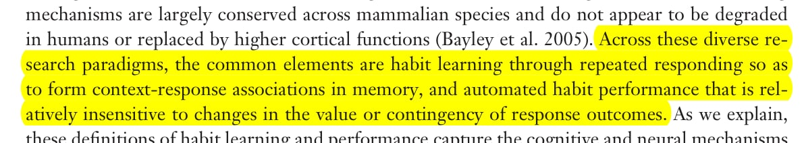

## A Habit

Basic habitual behavior is:

1. Cue

2. Response

    

In more detail it is:

(Wood & Rünger, 2016)

Starting from goal system and going counter clockwise: 

1. The **goal system** makes you act by motivating you to an end state
    - Goal: Working on a personal project
2. You are **exposed** to some "context" when you get cues:
    - Sitting at the computer and beginning to work. The contextual cues are the entirety of the stimuli you experience: Sounds, sights, smells, thoughts. 
    - The exposure can be involuntary: Seeing an ad for fast food
3. You develop a **memory** of the context and associate it with a behavioral response
    - The context of being at the computer is linked in the mind with a previous behavior, like watching youtube
    - Context — Behavior
    - This is also referred to as "memory pathways" or "dopamine pathways" which are being "struck" because of the particular cue
4. The habitual **response**
    - Watching youtube. 
5. (Grey arrow) Making **inferences** about how important the habit is to your goal by observing your own behavior and coming to (maybe wrong) conclusions 
    - "I do it, therefore it's probably what I intended"
    - The stronger the habit, the more prone to this error.

Here, although you start with 1. Goal directed, 2. **habit directed can take over** merely by providing the right context cues. With youtube: You open your phone (context cue), a memory pathway is activated, and then you watch youtube (habituated behavior). There's no goal guiding this behavior, you don't actually want to watch youtube. But you do.

And the more you do this, the more you think it's goal directed behavior and not habit directed (you start to get deluded.)

## **Stress and Habits**

Stress will push you into more automatic behavior. You just don't want to think. This can be compounded by condemning yourself and pressing play on various negative self talk tapes.

Recognize that during stress, you may fall back on old habits—especially if they were relatively recently worked on. Move on from the set back and continue Positive Habit and Habit Changing.

## **Positive Habit and Habit Changing**

Cueing, response and reward can be strategically manipulated to align habitual behavior with goals. E.g.:

- Cue: 
    - Placing items on the desk to remind you of your goals.
    - Performing the behavior in a specific location only
    - Playing some music
- Response:
    - Goal directed behavior (e.g. working on a task, exercising)
- Reward:
    - You can artificially enhance the reward
    - "I will eat x after doing y"
    - "I will watch an episode of x after doing y"

Repetition (and the other factors of Habit Formation) will increase the strength of the habit and make it possible to flip on autopilot without the risk of going off course during stressful times. This, to me, is the most powerful aspect of consciously created habits.

## **Habit Formation**

A habit will not necessarily form from a cue and a response. The following can influence it:

- Need to make decisions (reduces)
    - Do you need to make many thoughtful decisions about the habitual behavior? Are you thinking: What to do, where to go, or weighing options? The chance of habit forming is reduced

- Repetition (increases)

- Strength of reward (increases)

- Schedule period of reward
    - Random (increases)
    - Fixed but not too often (increases)
    - Too often (reduces)

## **Circuit Breaking** 

A (maybe necessary) drastic step to get you out of an endless loop. This is an enforced pause in the behavior. E.g.: A retreat with no phone, computer or internet access.

## **Finally**

It's strange how, as a species, we haven't solved really this issue. And yet it is material existence.

This article uses information from the following source (full access available at link):

Wood, W., & Rünger, D. (2016). Psychology of habit. *Annual Review of Psychology*, *67*(1), 289–314. [https://doi.org/10.1146/annurev-psych-122414-033417](https://doi.org/10.1146/annurev-psych-122414-033417 ) 
