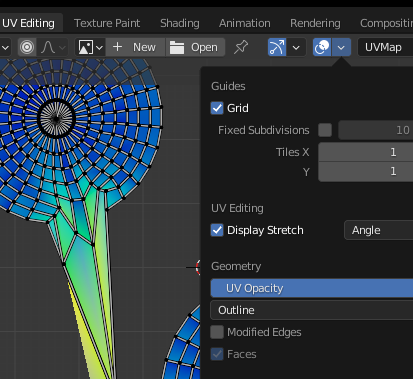

### Intro

This information is useful for creating models for games.

### Retopology 

- Standard term. In this context: Creating a lower polygon mesh using your high poly.
- Two ways: **manually** (drawing edges, shaping planes—see [this](https://www.youtube.com/watch?v=X2GNyEUvpD4) video for the latest techniques) or **automatically** with a plugin like [Quad Remesher](https://exoside.com/quadremesher/)
    - Manual: 
        - pros: the low poly will be more accurate and have better toplogy. A good low poly will aid texture baking, UV unwrapping and animation.
        - cons: more time consuming
    - Automatic:
        - pros: less time
        - cons: the result can be hit and miss and may require fiddling that would take as much time as doing it manually.

### UV unwrapping

With the newly created low poly, the 3D surface needs to be converted to a 2D format. The u and v in UV are 2D coordinates like x and y. I still do not know why it's not just called xy unwrapping (even if not absolutely accurate).

This can be thought of as like cutting the clothing off a standing person knowing that you'll have to sew it back up again (after painting the clothes). You want to think ahead about where your "seems" will be. E.g. you could make a cut under the whole sleeve so when their  arms are at their sides you can't see it—but you'll enevitably have to cut around the whole shoulder.

- In edit mode, select the edges, or vetices in a line, and then Ctrl + E > mark seem (or clear seem). Shift clicking will auto complete a line.

- Select UV editing mode at the top
- Press A in the edit window to select the whole mesh, then
- Press U to unwrap it

In the UV editor's minimap the "uv islands" will appear. These are like pieces of cloth you cut off.  

#### Tips:

- If you don't see anything in the uv minimap, make sure you are in edit mode and have the mesh selected
- "islands" in the minimap can be scaled up and down (with "s"). This gives them more / less coverage and therefore detail in the texture.
- On the UV window toolbar is a "UV" item. UV > pack islands, wil automatically rearrange the islands to make use of the space.
- "**Stretching**" (where the 2D and 3D map are too mismatched) can be displayed using this menu:

